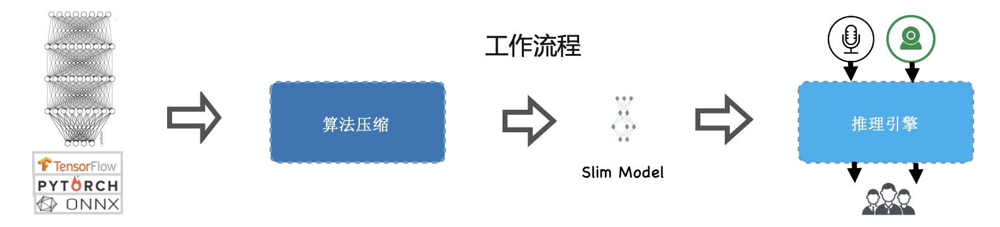
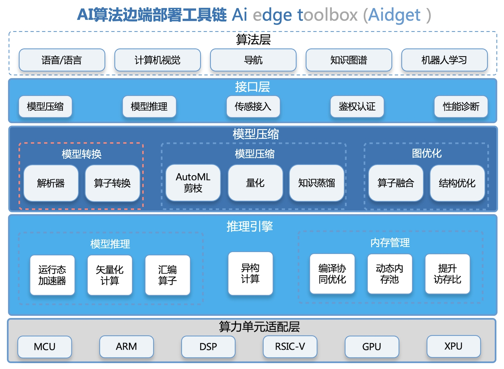
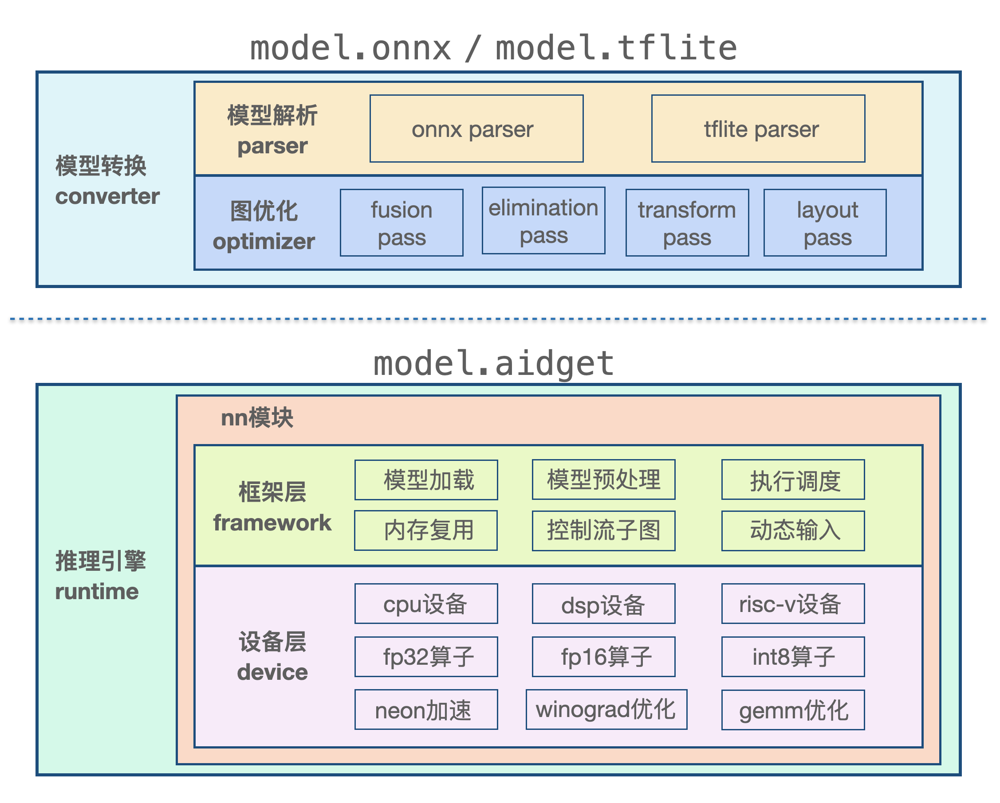

# 关于

👋 Hi, I'm Aidget.

    Aidget 发音 [eɪdʒɪt]
    Aidget = Ai edge toolchain
    Aidget = Compressor +  Inference Engine
    Aidget中文名：边端AI算法部署工具链

## Aidget介绍
Aidget是美的AI创新中心自研的高性能深度学习推理引擎和模型自动化压缩工具链，主要应用于`linux/rtos/android/ios`等不同边端系统，面向`armv7/v8`及`dsp`等不同边端平台提供指令级加速；针对多计算单元设备，提供高性能异构计算能力；针对边端小内存设备，在内存管理方面做了精心的优化设计；同时，Aidget支持模型小型化、控制流子图和dynamic shape等推理高阶特性。

目前已正式运用到美的集团各事业部不同项目的AI部署业务中，成功支持了语音冰箱空调、机器人等智能家电量产销售。

## Aidget开发初衷

目前AI算法通用部署工具链无法满足生产需求：
- 操作系统和芯片种类繁多，工程化部署难度高、人效低
- 通用工具链无法适用于资源及其有限的家电和IoT设备
- 通用工具链对语音算法支持较弱

AI算法部署的痛点：
- 工程与算法脱节
- 在资源极低的家电设备上，性能无法保证
- 操作系统和芯片种类繁多，重复工作量大
- 大量需求与语音相关

Aidget核心设计理念：
- a 模型压缩自动化
  - 保证易用性
  - 提升压缩率

- b 边端高性能
  - 解决低资源瓶颈
  - 缩短部署周期

## 整体特点
- 轻量性
  - 推理框架主体代码无任何第三方库依赖，代码精简，算子注册接口可根据模型实际使用的算子进行定制化裁剪;
  - 可方便地部署到包括移动设备和嵌入式设备等各种边缘设备上；支持模型FP16和INT8量化，可进一步减少模型50%-75%的体积。
- 通用性

  - 支持onnx和tflite两种主流的模型文件格式；
  - 算子支持列表丰富，支持158个onnx算子，支持79个tflite算子；
  - 支持多输入/多输出、支持任意维度的输入输出、支持dynamic shape、支持带控制流的模型；
  - 支持linux/rtos/android/ios。
- 易用性
  - api接口简单易用，所需的public头文件也非常精简；
  - 同时提供了c++ api接口和c api接口，方便不同部署场景调用。
- 高性能
  - 针对arm v7/v8架构，手写neon汇编kernel，充分提升cpu算子性能;
  - 针对cadence dsp架构，通过优化dsp汇编算子，充分发挥dsp的算力；
  - 广泛使用winograd卷积算法提升卷积性能，并取得了不错的加速效果；
  - 针对不同cpu架构实现了不同分块大小的矩阵乘法，显著提升了matmul、lstm等算子性能；
  - 支持int8/fp16量化模型的推理部署，针对arm v8.2架构扩展指令集进行了适配，取得了更好的加速效果。

## 架构设计

aidget推理框架分为模型转换（converter）和推理引擎（runtime）两部分

- 模型转换
  - aidget_converter:由parser和optimizer两部分组成，前者负责解析onnx和tflite模型，把训练框架算子转换成aidget算子格式，后者负责图优化，通过算子融合、冗余算子消除、算子替换、布局调整等方式优化图，一般离线运行；
- 推理引擎
  - aidget推理引擎的输入是一个二进制模型文件，推理时首先加载模型，然后经过预处理把模型从抽象的图转换为具体的算子和张量连接的描述形式，然后再通过内存复用逻辑和执行调度逻辑，把模型中的每一个算子下发到后端设备上进行算子kernel。

## 致谢
Aidget借鉴与参考了如下项目：

- [Tensorflow](https://github.com/tensorflow/tensorflow)
- [ncnn](https://github.com/Tencent/ncnn)
- [MNN](https://github.com/alibaba/MNN)
- [paddle-mobile](https://github.com/PaddlePaddle/paddle-mobile)
- [ONNX](https://github.com/onnx/onnx)
- [Caffe](https://github.com/BVLC/caffe)
- [flatbuffer](https://github.com/google/flatbuffers)
- [pytorch](https://github.com/pytorch/pytorch)

## 联系我们

email: aidget@midea.com
