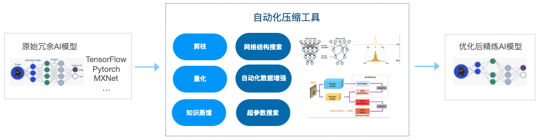
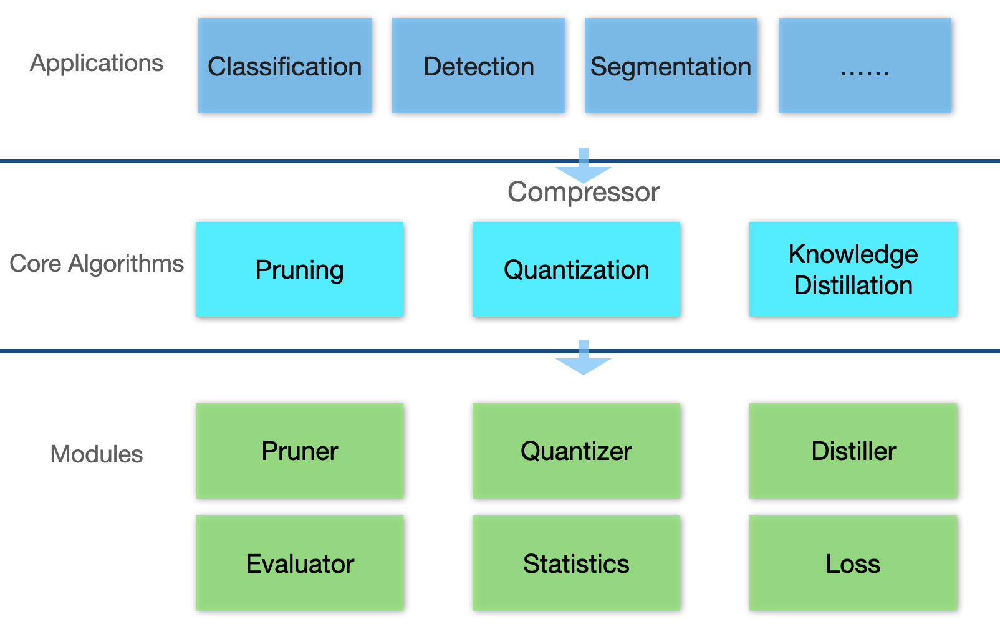
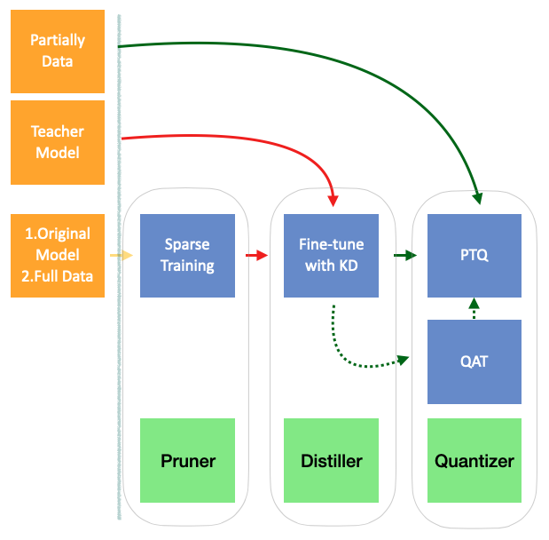

# 自动化压缩工具


## 介绍
自动化压缩工具是负责压缩深度学习模型的工具，包括剪枝、量化、知识蒸馏主流压缩技术。
- 模型剪枝：可将模型中冗余的权重找到并删除。本框架针对提速目的，主要支持结构化/通道剪枝。
- 模型量化：可将模型浮点FP32模型量化到整型INT8模型，实现降低模型存储及内存使用，配合Aidget推理引擎实现加速推理。(Release soon)
- 知识蒸馏：可将强大的教师网络模型的知识转移到紧凑的学生网络模型，从而提升学生模型的精度性能，知识蒸馏可分为logits蒸馏和特征蒸馏。



### 特点
- 压缩性能强，结合多种SOTA压缩算法实现模型高压缩比。
- 易用性高，无需专业经验，实现模型与前沿算法解偶，降低使用门槛。
- 可扩展性强，支持前沿压缩算法扩展。
### 工作流程
压缩算法可单独使用也可配合使用。



### 环境
- python3 
- pytorch >= 1.12.0
### 安装与卸载
- 安装
    ```bash
    python setup.py develop
    ```
- 卸载
    ```bash
    python setup.py develop --uninstall
    ```

### 算法支持

| 类别  |    名称     |                                                                                                              相关算法                                                                                                              |
|:---:|:---------:|:------------------------------------------------------------------------------------------------------------------------------------------------------------------------------------------------------------------------------:|
| 剪枝  |  ResRep   | [ResRep: Lossless CNN Pruning via Decoupling Remembering and Forgetting](https://openaccess.thecvf.com/content/ICCV2021/papers/Ding_ResRep_Lossless_CNN_Pruning_via_Decoupling_Remembering_and_Forgetting_ICCV_2021_paper.pdf) |
| 蒸馏  | vanillaKD |                                                                        [Distilling the Knowledge in a Neural Network](https://arxiv.org/abs/1503.02531)                                                                        |
| 蒸馏  |    IRG    |              [Knowledge Distillation via Instance Relationship Graph](https://openaccess.thecvf.com/content_CVPR_2019/papers/Ahn_Variational_Information_Distillation_for_Knowledge_Transfer_CVPR_2019_paper.pdf)              |
| 蒸馏  |    VID    |              [Variational Information Distillation for Knowledge Transfer](https://openaccess.thecvf.com/content_CVPR_2019/papers/Liu_Knowledge_Distillation_via_Instance_Relationship_Graph_CVPR_2019_paper.pdf)              |
| 量化  |    KL     |                                                                                                  Kullback-Leibler Divergence                                                                                                   |


## 联系方式

email: aidget@midea.com